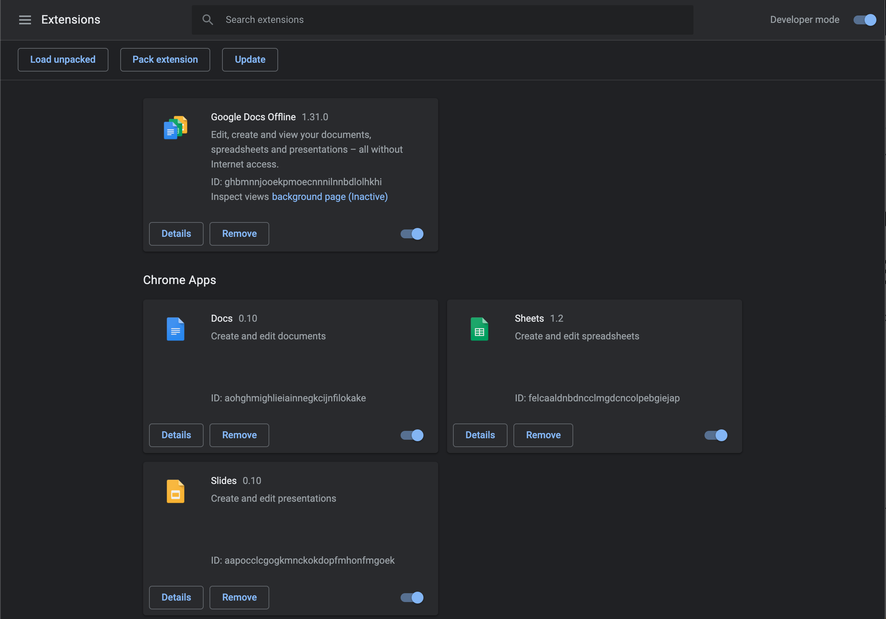
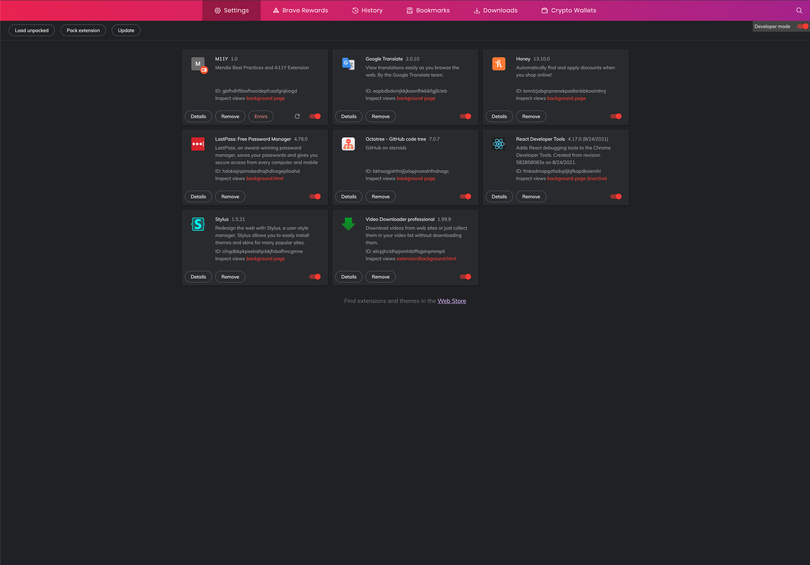
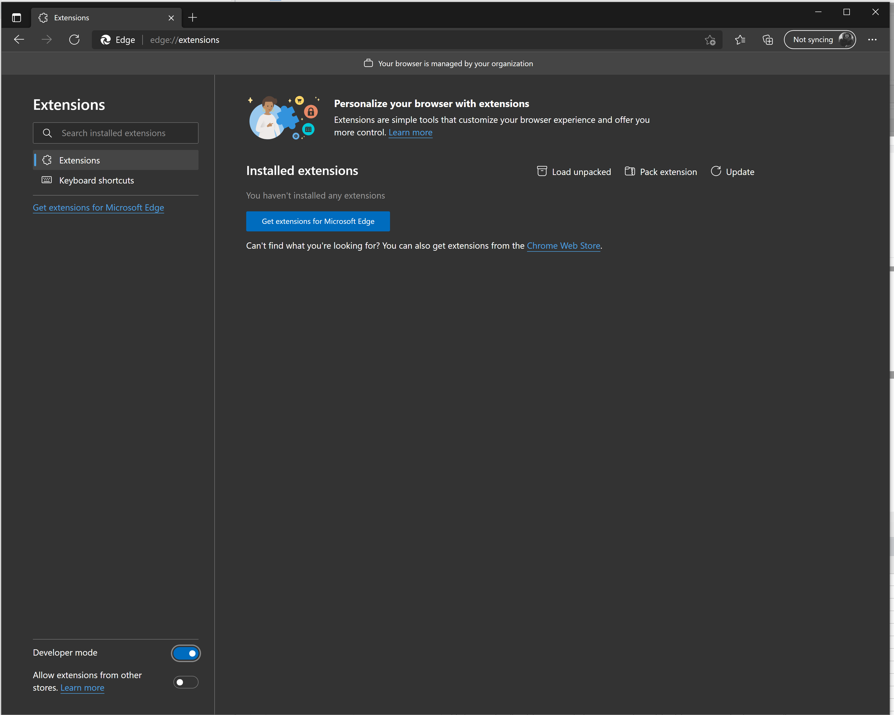

## How To Install

1. Download and Unzip Build

   Download the latest release zip and unzip M11Y from [here](https://github.com/ahwelgemoed/mx-a11y-extention/releases)

2. Set Chrome Extension into Developer mode

- Open a new tab and navigate to `chrome://extensions/` or `brave://extensions/` or `edge://extensions/`

- Switch on Developer mode

<table style="width:100%">
  <tr>
    <td style="width:33%">
   
    </td>
    <td style="width:33%">
    
    </td>
    <td style="width:33%">
    
    </td>
  </tr>
</table>

- Click on `Load Unpacked`

- In the file dialog navigate to the unzipped build folder and select it.

- Now the extension will be in your list of extensions and you can use it.

_Enjoy M11y_ 🧡
