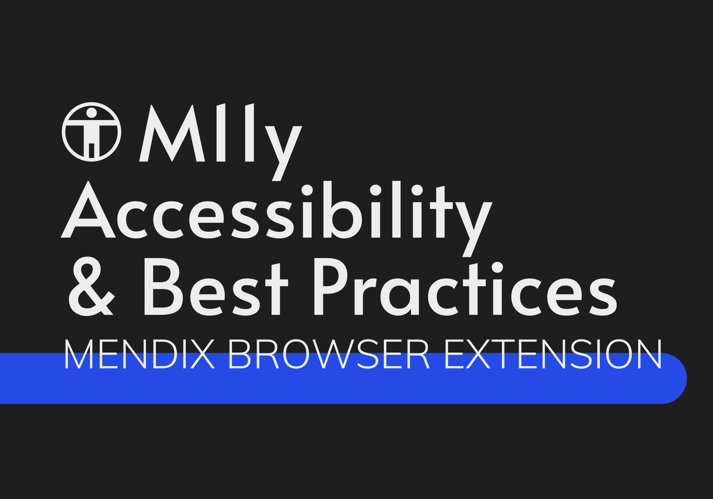
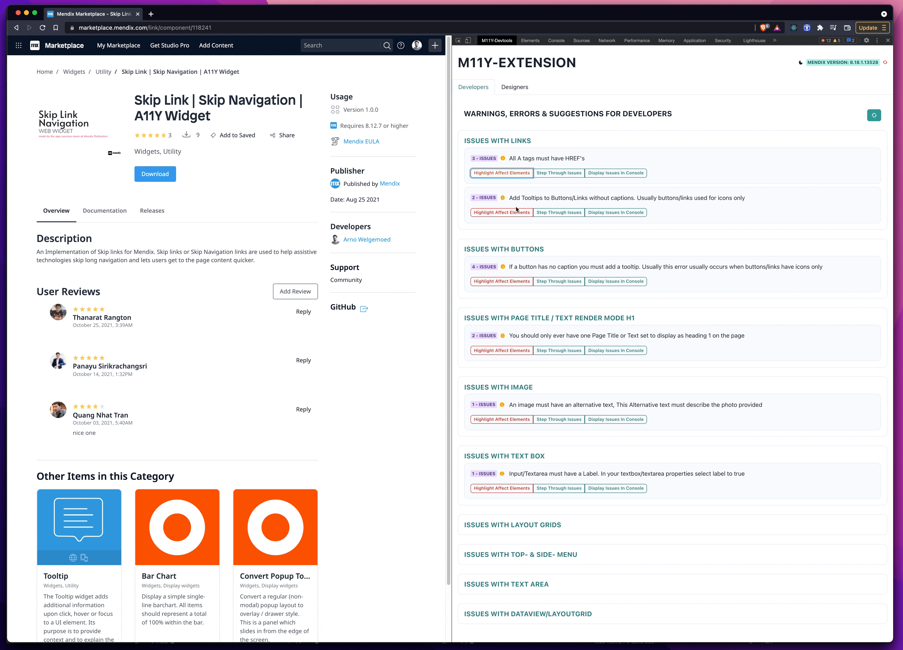
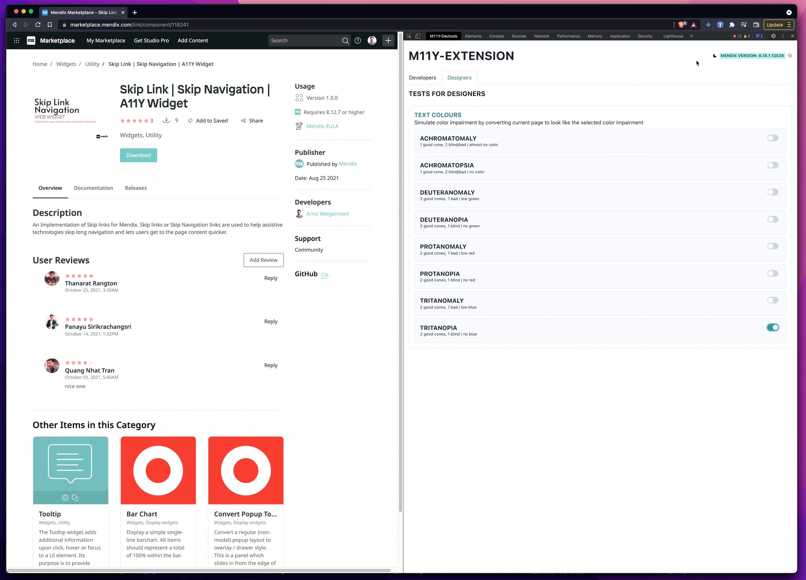

<h3 align="center">M11y Accessibility
& Best Practices  Browser Extension</h3>

Track current Project status <a href='https://github.com/mendixlabs/m11y/projects/1' target="_blank">here</a>

---

## Features

- Audits the dom to see if "obvious" accessability mistakes was made
- The extension will advise on if general best practices are followed
- Step through errors to see them
- Simulate Color impairments with 8 simulations

<table style="width:100%">
    <tr>
        <td>
       View in Dev tools
        </td>
        <td>
      
        </td>
    </tr>
    <tr>
        <td>
      See Issues in Dom (highlighted with CSS border)
        </td>
        <td>
      
        </td>
    </tr>
    <tr>
        <td>
       Step Through warnings and errors (highlighted with CSS border asn scrolled to)
        </td>
        <td>
      
        </td>
    </tr>
    <tr>
        <td>
       See difficult to see error in Javascript console
        </td>
        <td>
      
        </td>
    </tr>
    <tr>
        <td>
       Run Color Tests to Simulate 8 different types of color impairment
        </td>
        <td>
      
        </td>
    </tr>
    <tr>
        <td>
        Pop out View
        </td>
        <td>
      
        </td>
    </tr>
    <tr>
        <td>
      Darkmode 🌃
        </td>
        <td>
      
        </td>
    </tr>
   
</table>

## Current checks

- Buttons/Anchors have correct aria labels and captions especially for Icon only buttons
- No Empty `.col`
- Data view as base of page
- Multiple h1 checks
- Image Alt tag check
- Input/Textarea must have a Label
- Long Menu helper (Skip navigation)

## Install Locally

Install project locally [here](/Install.md)

## Help/Contribute

Contribute see [here](/CONTRIBUTING.md)

## Special Thanks and Packages Used

- [Ashley Sheridan](https://github.com/AshleyJSheridan) for their great article on Matrixs Color filters ([here](https://www.ashleysheridan.co.uk/blog/Testing+Colour+Blindness+Effects+Online+with+SVG+Filters))

- [Jason Teunissen](https://github.com/jasonteunissen) for being one of the first people to really embrace this project with meaningfull feed back and testing

- [The APCA version in this repositiory is licensed to the W3/AGWG per the collaborative agreement.](https://github.com/Myndex/apca-w3)

- Color Contrast [Inspiration](https://github.com/bruskowski/color-contrast-checker/blob/master/src/picker.js)

- Styling with [Chakra-UI](https://github.com/chakra-ui/chakra-ui)
